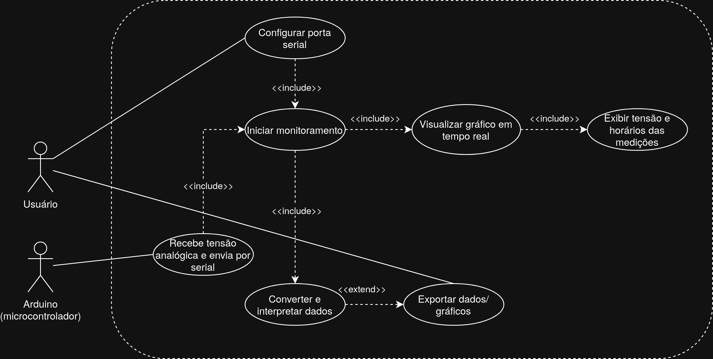
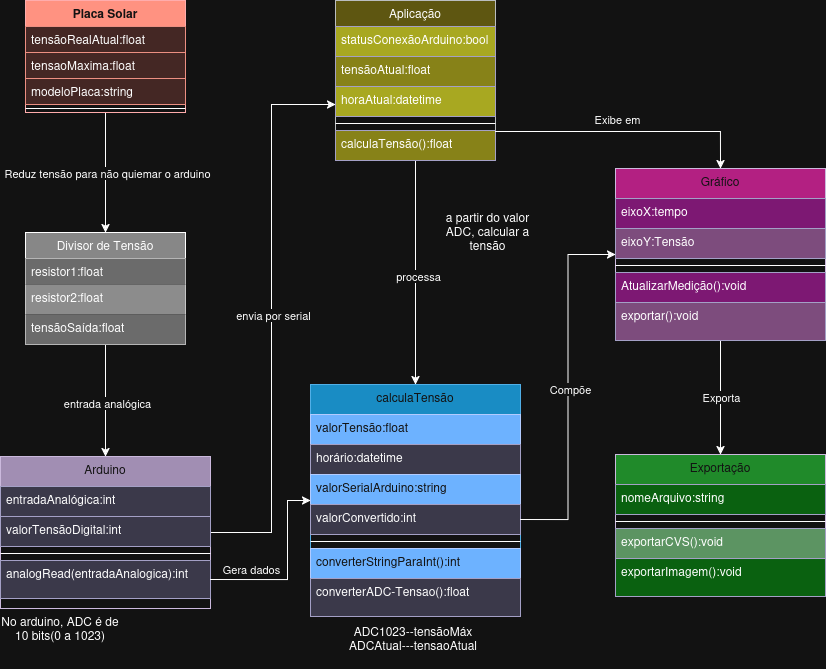
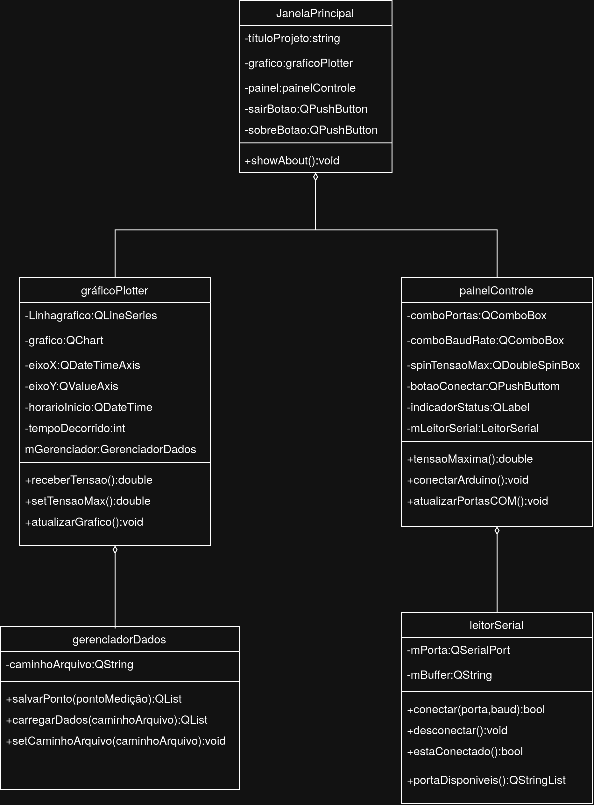

# Análise orientada a objeto
> [!NOTE]
> A **análise** orientada a objeto consiste na descrição do problema a ser tratado, duas primeiras etapas da tabela abaixo, a definição de casos de uso e a definição do domínio do problema.

## Descrição Geral do Domínio do Problema

O projeto consiste no desenvolvimento de uma aplicação em C++ capaz de monitorar, em tempo real, a tensão gerada por uma placa solar por meio de comunicação serial com um microcontrolador (como um Arduino).

A tensão original da placa solar (aproximadamente 20,64V) será reduzida para níveis seguros de leitura pelo microcontrolador utilizando um divisor de tensão. O Arduino será responsável por realizar a leitura analógica dessa tensão e enviá-la via comunicação serial para o programa em C++.

A aplicação terá como principal objetivo coletar, processar e visualizar esses dados ao longo do tempo, permitindo ao usuário acompanhar o comportamento da geração de energia durante o dia. Os dados serão apresentados na forma de um gráfico, onde:

- O eixo **X** representará o tempo (horário das medições)
- O eixo **Y** representará a tensão medida

O usuário poderá exportar os dados ou o gráfico gerado para análise posterior.

---

# Requisitos Funcionais

- Realizar comunicação serial com o microcontrolador
- Receber dados de tensão em tempo real
- Converter e interpretar os dados recebidos
- Plotar gráfico da tensão ao longo do tempo
- Atualizar o gráfico dinamicamente
- Exibir informações de horário associadas às medições
- Permitir exportação dos dados coletados (ex: CSV)
- Permitir exportação do gráfico (ex: imagem)

---

# Requisitos Não-Funcionais

- Interface simples e de fácil utilização
- Baixo consumo de recursos computacionais
- Atualização em tempo real com baixa latência
- Código modular e bem estruturado
- Confiabilidade na leitura e armazenamento dos dados
- Precisão na representação gráfica

---

# Possíveis Extensões Futuras

- Monitoramento de corrente e cálculo de potência
- Armazenamento em banco de dados
- Interface gráfica mais avançada (GUI)
- Acesso remoto aos dados (via rede)

## Diagrama de Casos de Uso

 
 Visão Geral

O sistema tem como objetivo monitorar tensões medidas por um microcontrolador Arduino, exibindo os dados em tempo real e permitindo sua exportação.

## Atores

### Usuário

Responsável por interagir com o sistema, configurando a comunicação serial, iniciando o monitoramento e exportando dados ou gráficos.

### Arduino (Microcontrolador)

Responsável por receber a tensão analógica dos sensores e transmitir os dados para o computador através da porta serial.  

## Casos de Uso
1. Configurar Porta Serial

    Ator: Usuário

Permite selecionar e configurar a porta serial utilizada para comunicação com o Arduino.

2. Receber Tensão Analógica e Enviar por Serial

    Ator: Arduino

O Arduino realiza a leitura da tensão analógica e envia os valores pela comunicação serial.

3. Iniciar Monitoramento

    Ator: Usuário

Inicia a aquisição de dados provenientes do Arduino.

Pré-condições:  
-Porta serial configurada.  
-Arduino conectado e transmitindo dados.

4. Converter e Interpretar Dados

    Ator: Sistema

Recebe os dados enviados pela serial e realiza sua conversão para valores compreensíveis ao usuário.

5. Visualizar Gráfico em Tempo Real

    Ator: Sistema

Exibe continuamente os dados recebidos em forma de gráfico.

6. Exibir Tensão e Horários das Medições

    Ator: Sistema

Mostra os valores de tensão juntamente com o horário em que cada medição foi realizada.

7. Exportar Dados/Gráficos

    Ator: Usuário

Permite salvar os dados coletados ou os gráficos gerados para uso posterior.

Pré-condição:  
-Existirem dados já coletados e interpretados.

## Fluxo Principal
1. O usuário configura a porta serial.  
2. O Arduino começa a enviar os valores de tensão pela serial.  
3. O usuário inicia o monitoramento.  
4. O sistema recebe, converte e interpreta os dados.  
5. Os dados são exibidos em um gráfico em tempo real.  
6. O sistema apresenta os valores de tensão e os horários das medições.  
7. Opcionalmente, o usuário pode exportar os dados ou os gráficos gerados.  

## Diagrama de Domínio do problema

.

## Diagrama de classes:
.

[Retroceder](README.md) | [Avançar](projeto.md)

