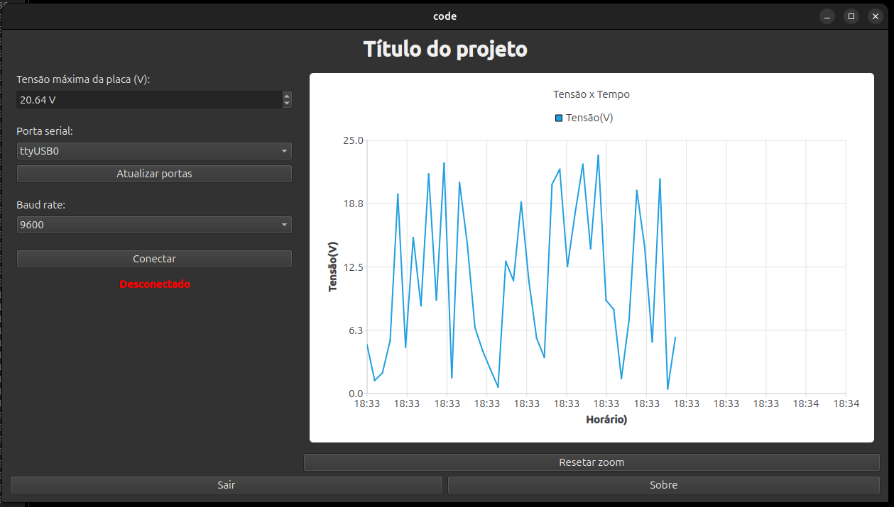

# Implementação

>[!NOTE] 
 Relatar o processo de implementação do problemas, incluindo as
 ferramentas e bibliotecas utilizadas
>
# Log 01:
Implementou-se um protótipo da janela com alguns widgets para uma primeira visualização.
À esquerda localiza-se o painel de controle. Acima, uma barra permite que o operador defina a tensão máxima da placa solar. O valor definido deve alterar a ordenada do gráfico em tempo real. Ainda à esquerda, foram inseridos os botões e comandos/dados necessários para a conexão com o Arduino (ainda não testada).

À direita, há um gráfico que se atualiza dinamicamente. No eixo vertical está a tensão, e no horizontal, o tempo. Esse gráfico emprega o horário do sistema para iniciar a medição. Atualmente, o valor de tensão é gerado aleatoriamente para fins de teste, sem qualquer vínculo com a leitura do Arduino. O gráfico realiza a coleta ao longo de 24 horas, sendo assim necessária a funcionalidade de aplicar zoom in/out para que o usuário faça a observação com a precisão desejada. Acrescentou-se um botão para restaurar a visualização padrão.

Na janela principal, na parte inferior, adicionaram-se dois botões. Um para encerrar o programa (Sair) e outro que descreve o propósito do programa (Sobre). 

## bibliotecas utilizadas:

| Módulo | Para que serve no projeto |
|---|---|
| `Qt::Core` | Base do Qt — `QTimer`, `QDateTime`, `QFile`, `QDir`, `QString`, `QList` |
| `Qt::Widgets` | Interface gráfica — `QWidget`, `QPushButton`, `QLabel`, `QComboBox`, `QDoubleSpinBox`, `QMessageBox`, layouts |
| `Qt::Charts` | Gráfico — `QChart`, `QChartView`, `QLineSeries`, `QDateTimeAxis`, `QValueAxis` |
| `Qt::SerialPort` | Comunicação serial com o Arduino — `QSerialPort`, `QSerialPortInfo` | 
|

[Retroceder](projeto.md) | [Avançar](testes.md)

