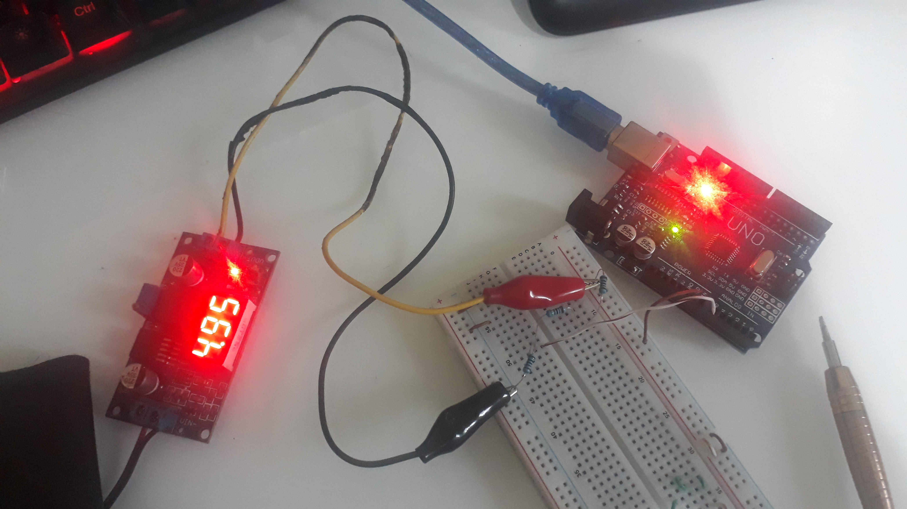
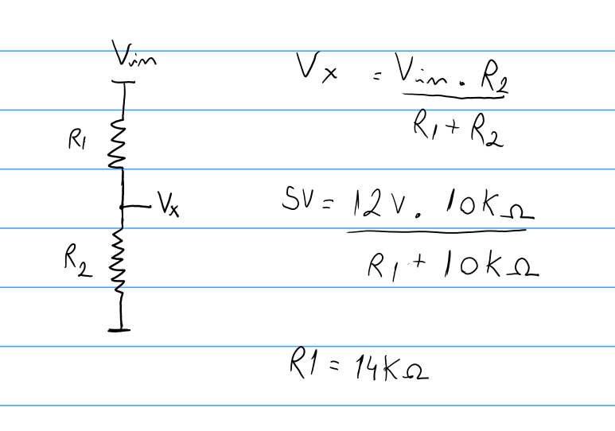
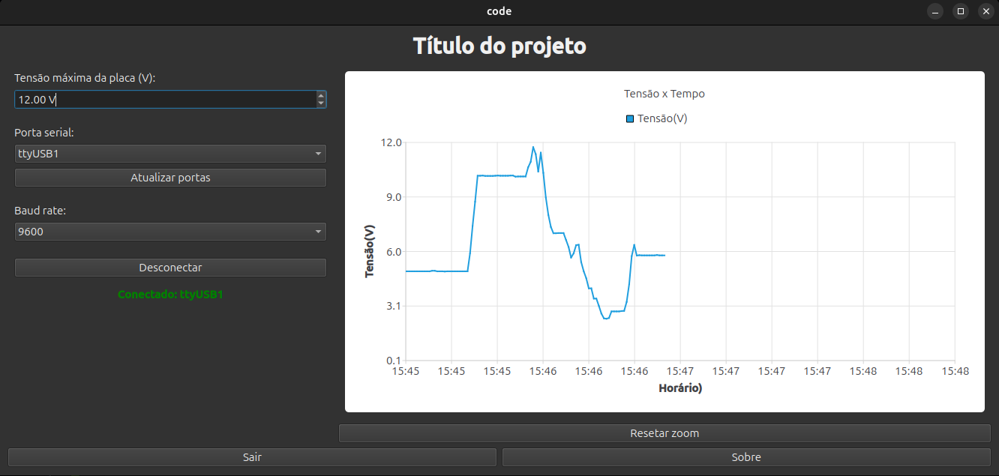

# Implementação

>[!NOTE] 
 Relatar o processo de implementação do problemas, incluindo as
 ferramentas e bibliotecas utilizadas
>
# Log 01:
Implementou-se um protótipo da janela com alguns widgets para uma primeira visualização.
À esquerda localiza-se o painel de controle. Acima, uma barra permite que o operador defina a tensão máxima da placa solar. O valor definido deve alterar a ordenada do gráfico em tempo real. Ainda à esquerda, foram inseridos os botões e comandos/dados necessários para a conexão com o Arduino (ainda não testada).

À direita, há um gráfico que se atualiza dinamicamente. No eixo vertical está a tensão, e no horizontal, o tempo. Esse gráfico emprega o horário do sistema para iniciar a medição. Atualmente, o valor de tensão é gerado aleatoriamente para fins de teste, sem qualquer vínculo com a leitura do Arduino. O gráfico realiza a coleta ao longo de 24 horas, sendo assim necessária a funcionalidade de aplicar zoom in/out para que o usuário faça a observação com a precisão desejada. Acrescentou-se um botão para restaurar a visualização padrão.

Na janela principal, na parte inferior, adicionaram-se dois botões. Um para encerrar o programa (Sair) e outro que descreve o propósito do programa (Sobre). 

## bibliotecas utilizadas:
| Módulo | Para que serve no projeto |
|---|---|
| `Qt::Core` | Base do Qt — `QTimer`, `QDateTime`, `QFile`, `QDir`, `QString`, `QList`,  `QCoreApplication` |
| `Qt::Widgets` | Interface gráfica — `QWidget`, `QPushButton`, `QLabel`, `QComboBox`, `QDoubleSpinBox`, `QMessageBox`, `QFileDialog`, `QToolTip`, layouts |
| `Qt::Charts` | Gráfico — `QChart`, `QChartView`, `QLineSeries`, `QDateTimeAxis`, `QValueAxis` |
| `Qt::SerialPort` | Comunicação serial com o Arduino — `QSerialPort`, `QSerialPortInfo` |


## Log 02: Persistência de dados e continuidade do gráfico

Identificou-se um problema de usabilidade: ao encerrar e reabrir o programa,
o gráfico reiniciava do zero, perdendo todas as medições anteriores do dia.

Para resolver isso, criou-se a classe `GerenciadorDados`, responsável por
salvar e carregar medições em arquivo CSV. A classe oferece os seguintes
métodos principais:

- `salvarPonto()` — acrescenta um ponto ao CSV a cada nova leitura recebida
- `carregarDados()` — lê o CSV e retorna a lista de pontos ao iniciar
- `temDadosDeHoje()` — verifica se já existe um arquivo do dia atual

O arquivo é criado automaticamente na pasta `code/build/Desktop-Debug/dados/` dentro do diretório
do executável, com o nome `medicoes_YYYY-MM-DD.csv`. Um novo arquivo é
gerado a cada dia, preservando o histórico.

Ao iniciar, o `graficoPlotter` chama `carregarDadosAnteriores()`, que
reinsere os pontos salvos na série do gráfico e recalcula o `tempoDecorrido`
com base no horário atual do sistema — e não no último ponto salvo — evitando
um bug onde novos pontos eram inseridos no passado e desapareciam ao aplicar zoom.

```cpp
// Cálculo correto do tempo decorrido ao reabrir o programa
tempoDecorrido = horarioInicio.secsTo(QDateTime::currentDateTime());
```

---

## Log 03: Melhorias de interatividade no gráfico

### Zoom centrado no cursor do mouse

O comportamento padrão do `QChartView` aplica zoom sempre no centro da área
do gráfico. Para tornar a navegação mais intuitiva — similar ao comportamento
de ferramentas como Google Maps — implementou-se zoom centrado na posição
do cursor.

Criou-se a subclasse `ChartViewInterativo`, que herda de `QChartView` e
sobrescreve os eventos de mouse. O zoom é calculado geometricamente: a
proporção do cursor dentro da área visível (`propX`, `propY`) é usada para
deslocar o retângulo de zoom, mantendo o ponto sob o cursor fixo durante
a operação.

```cpp
double propX = (posicaoMouse.x() - areaAtual.left()) / areaAtual.width();
double propY = (posicaoMouse.y() - areaAtual.top())  / areaAtual.height();
```

O scroll para cima executa zoom in (fator 1,15) e para baixo zoom out
(fator 0,85). O arraste do gráfico é feito com o botão direito do mouse.
A seleção de uma faixa horizontal com o botão esquerdo (rubber band) também
aplica zoom naquela região.

### Restrição de limites do eixo

Para evitar que o zoom ou o arraste exibissem valores sem sentido físico
— tempo anterior ao início da medição ou tensão negativa — implementou-se
o método `corrigirLimites()`, chamado ao final de cada evento de mouse:

```cpp
// Impede tempo anterior ao início
if (eixoX->min() < mHorarioInicio)
    eixoX->setMin(mHorarioInicio);

// Impede tensão negativa
if (eixoY->min() < 0.0)
    eixoY->setMin(0.0);
```

### Tooltip com valor de tensão

Ao mover o mouse sobre o gráfico, um tooltip exibe o horário e a tensão
correspondentes à posição do cursor. A conversão é feita com
`chart()->mapToValue()`, que transforma coordenadas de tela em valores
dos eixos:

```cpp
QPointF valorGrafico = chart()->mapToValue(event->pos());
QDateTime horario = QDateTime::fromMSecsSinceEpoch(
    static_cast<qint64>(valorGrafico.x()));
```

---

# Log 05:
Implementou-se a função que faz a leitura serial do arduino.  
Com o código abaixo, o arduino envia a leitura da tensão analógica para a saída serial que será lido pelo software.
```cpp 
void setup() {
    Serial.begin(9600);
}  
void loop() {  
    int leitura = analogRead(A0);// Lê o pino analógico (0-1023)  
    float tensao = leitura * (12.5 / 1023.0);  // Converte para tensão   
    Serial.println(tensao);                     
    delay(1000);                                
}  
```
 
Além disto, efetuou-se os teste com os botões para a conexão e comunicação com o arduino, que agora está funcionando. O texto fica verde para indicar que a conexão foi efetuada com sucesso.  
Como "setup" de teste, utilizou-se uma fonte de 12V, um conversor buck, protoboard e 3 resistores para se fazer o divisor resistivo para não queimar aa porta analógica do arduino.


Para definir os valores dos resistores deve-se ter em mente que o valor máximo da leitura analógica do arduino é 5V. Então basta fazer um ralação de modo que 5V represente o valor máximo de tensão que será fornecida pela placa solar.

Foi realizado um teste para ver se o gráfico plotava o valor entregado pelo conversor buck.


---


## Log 06: Eixo X fixo das 06:00 às 06:00

Para que o gráfico sempre represente um ciclo solar completo — da manhã
de um dia até a manhã do seguinte — o horário de início foi fixado às
06:00:00 do dia atual, independentemente do horário em que o programa
é aberto:

```cpp
QDate hoje = QDate::currentDate();
horarioInicio = QDateTime(hoje, QTime(6, 0, 0));
tempoDecorrido = horarioInicio.secsTo(QDateTime::currentDateTime());
```

O `tempoDecorrido` é calculado a partir das 06:00, de modo que os pontos
são inseridos no horário correto do sistema mesmo que o programa seja aberto
horas depois do início da janela.

---

## Log 07: Exportação de dados e imagem

Adicionou-se ao painel lateral um botão **Exportar** que permite ao usuário
salvar o gráfico:

- **Imagem PNG** — captura do gráfico usando `QPixmap::grab()` sobre o
  `QChartView`  

A responsabilidade de abrir o diálogo e executar a exportação foi mantida
na `JanelaPrincipal`, que tem acesso tanto ao `graficoPlotter` quanto ao
`GerenciadorDados`. O `PainelControle` apenas emite o sinal
`solicitaExportacao()`.

---


<div align="center">


[Retroceder](projeto.md) | [Avançar](testes.md)

</div>